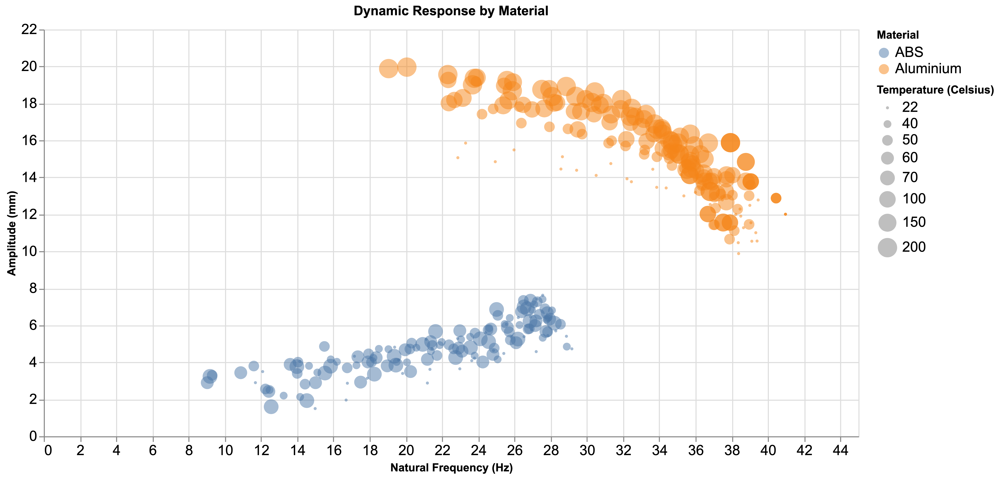
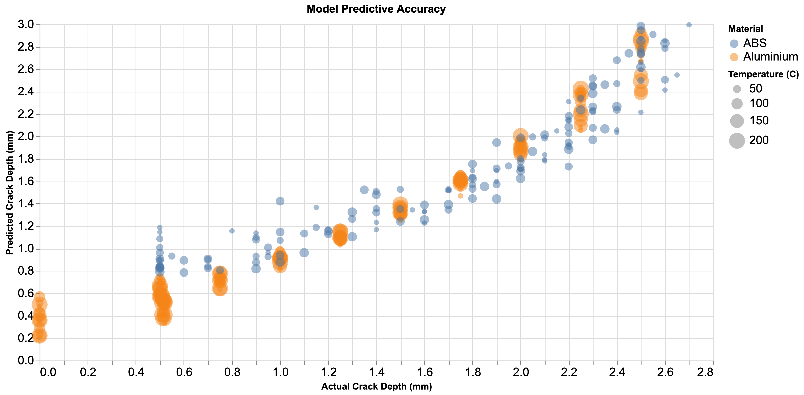
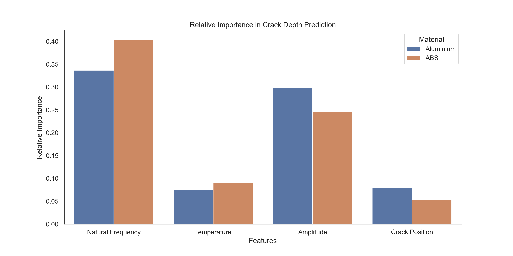

# MSc Project

Using machine learning to understanding relationships between dynamic structural response and thermomechanical couple loads.

Tom Fleet, Jun 2020

## Background

Experimental data on the effect of crack propagation on dynamic response (vibration) was generated in a series of earlier experiments on two different materials and given to me to work with for my MSc Advanced Materials thesis project in Spring 2020.

Starting notches were machined into test specimens which were then vibrated at their natural frequencies at a variety of temperatures. The cracks were then allowed to grow whilst natural frequency and amplitude measurements were continuously taken in order to determine the effect of crack propagation on dynamic properties.

The objectives of this work were to:

* Build a predictive model capable of accurately predicting damage severity and location from a simple vibration test.

* Use the introspection of the model to attempt to inform the fundamental underlying theory

## Results

After using [mlflow](https://mlflow.org) to analyse model shortlisting, I chose a Ridge-regularised multiple Linear Regression model to enable easy introspection as this was a key objective of the project.

The models were able to predict the depth of the crack with high accuracy (shown below) for both materials.

| Material      | RMSE          | R^2   |
|:-------------:|:-------------:|:-----:|
| Aluminium     | 0.176 mm      | 0.95  |
| ABS           | 0.256 mm      | 0.86  |

The reduced accuracy for the ABS was explained by the anisotropic structure and stress crazing at the crack tip caused by the method of manufacture of the test specimens (FDM additive manufacturing).

### Feature Importance

A key part of the project was to understand the underlying factors behind these effects, rather than simply generate predictions.

A feature importance study was conducted, results shown below.

The data show that the natural frequency was the most important predictor for both materials. Temperature and crack position were shown to be comparatively less important - an interesting finding.

### Further Information

A journal article is currently being submitted for this work and will be linked here when published.
